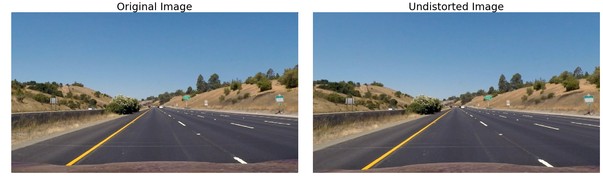

## Advanced Lane Lines Writeup

---

**Advanced Lane Finding Project**

The goals / steps of this project are the following:

* Compute the camera calibration matrix and distortion coefficients given a set of chessboard images.
* Apply a distortion correction to raw images.
* Use color transforms, gradients, etc., to create a thresholded binary image.
* Apply a perspective transform to rectify binary image ("birds-eye view").
* Detect lane pixels and fit to find the lane boundary.
* Determine the curvature of the lane and vehicle position with respect to center.
* Warp the detected lane boundaries back onto the original image.
* Output visual display of the lane boundaries and numerical estimation of lane curvature and vehicle position.

## [Rubric](https://review.udacity.com/#!/rubrics/571/view) Points

### Here I will consider the rubric points individually and describe how I addressed each point in my implementation.  

---

### Writeup / README

#### 1. Provide a Writeup / README that includes all the rubric points and how you addressed each one.  You can submit your writeup as markdown or pdf.  [Here](https://github.com/udacity/CarND-Advanced-Lane-Lines/blob/master/writeup_template.md) is a template writeup for this project you can use as a guide and a starting point.  

You're reading it!

### Camera Calibration

#### 1. Briefly state how you computed the camera matrix and distortion coefficients. Provide an example of a distortion corrected calibration image.

The code for this step is contained in the first code cell of the IPython notebook located in `advancedLaneLines.ipynb` under the title `Calibration and undistort`.

I start by preparing "object points", which will be the (x, y, z) coordinates of the chessboard corners in the world. Here I am assuming the chessboard is fixed on the (x, y) plane at z=0, such that the object points are the same for each calibration image.  Thus, `objp` is just a replicated array of coordinates, and `objpoints` will be appended with a copy of it every time I successfully detect all chessboard corners in a test image.  `imgpoints` will be appended with the (x, y) pixel position of each of the corners in the image plane with each successful chessboard detection.  Here is the function `cv2.drawChessboardCorners()` applied to the calibration images:


I then used the output `objpoints` and `imgpoints` to compute the camera calibration and distortion coefficients using the `cv2.calibrateCamera()` function.  I applied this distortion correction to a calibration image using the `cv2.undistort()` function and obtained this result: 


### Pipeline (single images)

#### 1. Provide an example of a distortion-corrected image.

To demonstrate this step, I will describe how I apply the distortion correction to some test images like these one:



#### 2. Describe how (and identify where in your code) you performed a perspective transform and provide an example of a transformed image.

The code for my perspective transform appears under the title `Perspective Transform` in the IPython notebook. It includes a class called `Warper()`.  The `Warper()` class is initialized with the inputs source (`src`) and destination (`dst`) points. It provides a function `to_birdview() ` that takes as inputs an image (`img`) and warp the image to a birdview. It also provides a function `to_normal() ` that takes as inputs an image (`img`)  (that have been already warped to birdview) and warp it back to the original image view. They use the OpenCV function `cv2.warpPerspective()`.

I chose to hardcode the source and destination points in the following manner:

```python
src = np.float32(
src = np.float32([(575,464),
                  (707,464), 
                  (1049,682),
                  (258,682)])
offset = 300
dst = np.float32([(offset,0),
                  (w-offset,0),
                  (w-offset,h),
                  (offset,h)])
```

This resulted in the following source and destination points:

|  Source  | Destination |
| :------: | :---------: |
| 575,464  |   300, 0    |
| 707,464  |   980, 0    |
| 1049,682 |  980, 720   |
| 258,682  |  300, 720   |

I verified that my perspective transform was working as expected by drawing the `src` and `dst` points onto test images and their warped counterparts to verify that the lines appear parallel in the warped image.


#### 3. Describe how (and identify where in your code) you used color transforms, gradients or other methods to create a thresholded binary image.  Provide an example of a binary image result.

For that, I started by exploring the colorspaces. It is in the IPython notebook under the title `Explore colorspaces`. 


Gray image


I chose to convert the image to HLS format.

I then used a combination of color and gradient thresholds to generate a binary image (thresholding steps in the function `binarize` in the IPython notebook). 

The following thresholds were used:

* S-channel = (120, 255) creating `s_binary`, that is useful for picking out lane lines under different color and contrast conditions, such as shadows
* L-channel = (40, 255) creating `l_binary` 
* Sobel filter on the X direction on L-channel = (20, 255) creating `sx_binary`, to get image edges that match the direction of the lane lines

and I combined the result binaries by using this function: `(l_binary == 1) & (s_binary == 1) | (sxbinary==1)`. 

 Here's an example of my output for this step (left images). 


You can see that the lane lines are well defined here.

Here is the same function applied on an original (non warped) test image:


#### 4. Describe how (and identify where in your code) you identified lane-line pixels and fit their positions with a polynomial?

Once I got the warped binary threshold images as explained above, I searched for the lane-lines. In this stage, we will try to extract the image pixels belonging to both the left and right lanes.

I did this in the functions `sliding_window()` and `non_sliding()`  in the IPython notebook.

##### Sliding window

Used only for the first frame (should be updated to also be used when the lane wasn't detected in the last frame, but this is not needed on the video `project_video.mp4` as lanes are detected on each frame).

I generate an histogram of the bottom of this image. 

```python
histogram = np.sum(binary_warped[int(binary_warped.shape[0]/2):,:], axis=0)
```


Then, I'm using the two peaks of this histogram (on left and right sides of the image) to determine good starting x values to start searching for lanes pixels at the bottom of the image.

```python
midpoint = np.int(histogram.shape[0]/2)
leftx_base = np.argmax(histogram[:midpoint])
rightx_base = np.argmax(histogram[midpoint:]) + midpoint
```

Once these points are calculated, I divide the image into 9 different strips of equal size.
Then, for the bottom strip, I search for the pixels belonging to each line in a margin around the starting x values, masking all other pixels of the image and effectively discarding all other "noise" pixels. 

If I found more points in these windows than a set threshold, I update the starting x values by using the mean of the values of the x values of these points.

I repeat this process for each strip.

Once I've processed all the strips, I'm left with two lists of the points belonging to the left and the right lanes.

##### Non-sliding window

Since the above approach is quite slow, I only use this on the first frame. For all other frames, I use the polynomial lanes equations for the previous frame (calculated in the stage below) to search in a margin around the corresponding x values.

```python
left_lane_inds = ((nonzerox > (left_fit[0]*(nonzeroy**2) + left_fit[1]*nonzeroy + left_fit[2] - margin))
        & (nonzerox < (left_fit[0]*(nonzeroy**2) + left_fit[1]*nonzeroy + left_fit[2] + margin)))
    right_lane_inds = ((nonzerox > (right_fit[0]*(nonzeroy**2) + right_fit[1]*nonzeroy + right_fit[2] - margin))
        & (nonzerox < (right_fit[0]*(nonzeroy**2) + right_fit[1]*nonzeroy + right_fit[2] + margin)))
```

##### Fit

Then I fit my lane lines with a 2nd order polynomial `f(y)=Ay2+By+C`  in the function `fit()` using Numpy`np.polyfit()` in the IPython notebook (image taken from the write_up template, for the convenience of the equations already written on it):


Here you can see the pixels selected as belonging to the left and right lines in blue and red. The other white points are the "noise" pixels. You can also see the fit lines in green.

#### 5. Describe how (and identify where in your code) you calculated the radius of curvature of the lane and the position of the vehicle with respect to center.

I did this in the function `calculate_radius_and_offset` in the IPython notebook.

##### Radius

I then find the radius of curvature for the bottom of the image for each lane using the formula given in the lesson.

```python
left_curverad = ((1 + (2*left_fit_cr[0]*y_eval*ym_per_pix + left_fit_cr[1])**2)**1.5) / np.absolute(2*left_fit_cr[0])
right_curverad = ((1 + (2*right_fit_cr[0]*y_eval*ym_per_pix + right_fit_cr[1])**2)**1.5) / np.absolute(2*right_fit_cr[0])
```

Finally, I calculate the mean of these radii of the lane lines to find the curvature of the lane. 

```python
radius = np.mean([left_curverad, right_curverad])
```

##### Position

Next, I calculate the camera position relative to the found lane lines.

```python
midpoint = np.int(img.shape[1]/2)
middle_of_lane = (right_fitx[-1] - left_fitx[-1]) / 2.0 + left_fitx[-1]
offset = (midpoint - middle_of_lane) * xm_per_pix
```

#### 6. Provide an example image of your result plotted back down onto the road such that the lane area is identified clearly.

I implemented this step in the function `draw_result_image()` in my code in the IPython notebook. 

I plotted the detected lane and lane lines on a blank image of the size of a warped image using OpenCV `cv2.fillPoly()`, then unwarped this image using the function `warper.to_normal()` and finally merged it with the undistorted image.

I also added on this result image the `Curvature radius` and `Lane Center Offset` information.

```python
cv2.putText(result,"Curvature Radius: " + "{:0.2f}".format(radius) + ' m', org=(50,75), fontFace=cv2.FONT_HERSHEY_SIMPLEX,
            fontScale=2, color=(0,0,0), lineType = cv2.LINE_AA, thickness=2)
cv2.putText(result,"Lane center offset: " + "{:0.2f}".format(offset) + ' m', org=(50,125), fontFace=cv2.FONT_HERSHEY_SIMPLEX,
            fontScale=2, color=(0,0,0), lineType = cv2.LINE_AA, thickness=2)
```

Here is an example of my result on test images:


---

### Pipeline (video)

#### 1. Provide a link to your final video output.  Your pipeline should perform reasonably well on the entire project video (wobbly lines are ok but no catastrophic failures that would cause the car to drive off the road!).

Here's a [link to my video result](https://youtu.be/5IPUeGWzxro). The video is also present in the repository under the name `final_output.mp4`.

---

### Discussion

#### 1. Briefly discuss any problems / issues you faced in your implementation of this project.  Where will your pipeline likely fail?  What could you do to make it more robust?

This solution doesn't work on the `challenge video` or the `harder challenge video` for several reasons:

* the binary thresholds set are not suitable for these videos
* no sanity check is performed on the detected lines to be sure that it was a good detection (Checking that they have similar curvature, checking that they are separated by approximately the right distance horizontally, checking that they are roughly parallel)
* after the first call, only the non-sliding window lane pixels finding approach is used, even if no line was detected on the last frame, and we can then lose a line

##### Possible improvements

* Add a tracking of the succeeding detected lane lines over the last *n* frames of video to obtain a cleaner result, so to smooth the detected lane and avoid them jumping around from frame to frame a bit. As well as to have smooth results for lane curvature and offset.


* Using sliding window lane pixels finding approach also if the line was not detected in the last frame (for the `project_video.mp4` video, it was not needed as the lines were found on each frame).
* Refactor code so not to execute processes two times for each line (for now, functions are executing processes on each line, then choosing one).


* Use Deep learning to detect lanes: tuning the thresholds for each transform is time consuming work and depends on the frames data we're tuning on. Some thresholds could fit for one image, but not for another. Using corresponding ground truth data, a neural network could learn these thresholds by itself.
